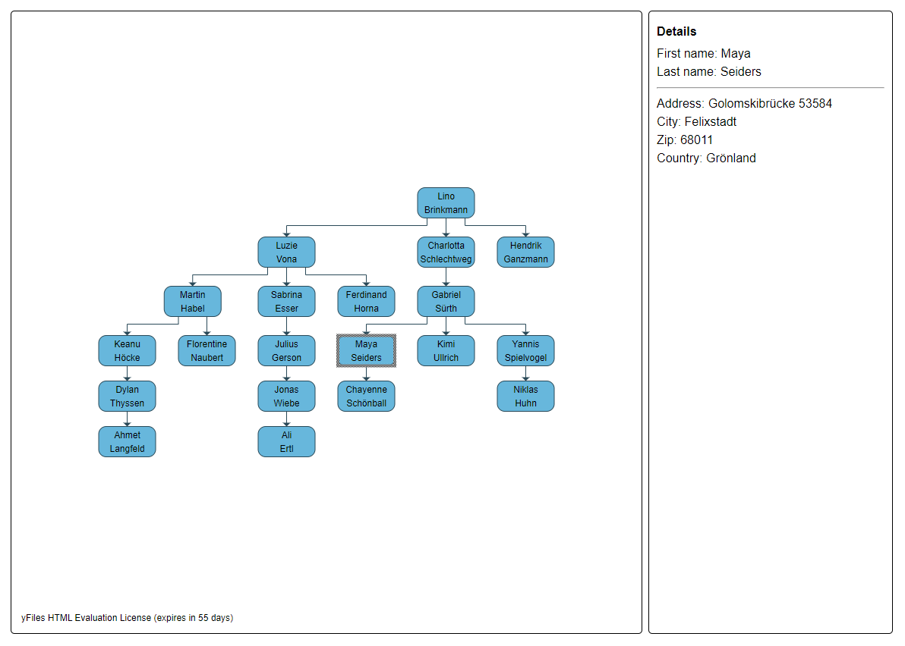
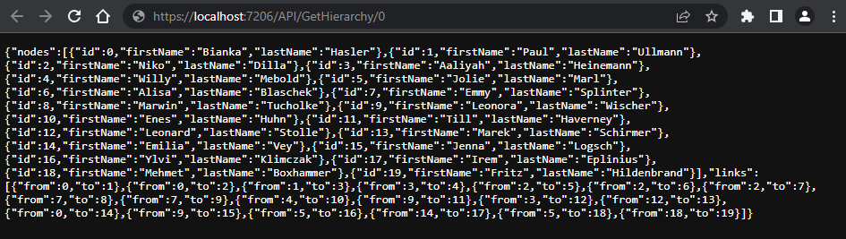
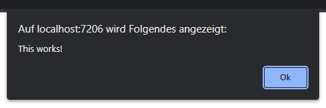
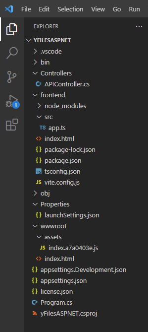

# yFiles for HTML with ASP.NET MVC backend

## Intro

This tutorial helps you create a simple application consisting of
- an HTML page with a [yFiles for HTML](https://www.yworks.com/yfiles-overview) diagram representing an organization chart with data fetched from an [ASP.NET MVC](https://learn.microsoft.com/de-de/aspnet/core/tutorials/first-mvc-app/start-mvc?view=aspnetcore-6.0&tabs=visual-studio) backend
- an ASP.NET MVC website with a WebAPI representing a REST-ful interface to some data backend. We don't describe or include any concrete database (access) layer but rather use some pseudo-random data generation to mimic this layer. A discussion of an ORM or webservice underneath the WebAPI is outside the scope of this tutorial.

The application shows an organization chart which upon clicking a node gives more information about the selected person.



The architecture is a simple client-service communication with the browser having an active role in fetching the data, i.e. the application is a single-page application (SPA).
We do not delve however in the many ways one can build up an MVC structure on the client using one of the many JS frameworks out there (Angular in particular).
The application is meant to be a jump-start showing how to use ASP.NET MVC together with yFiles.

## Table of contents

* [Setting up the project](#setting-up-the-project)
  * [Requirements](#requirements)
  * [Creating the project](#creating-the-project)
  * [Adding TypeScript](#adding-typescript)
  * [Installing yFiles](#installing-yfiles)
  * [Installing Vite](#installing-vite)
* [Creating the graph using yFiles](#creating-the-graph-using-yfiles)
  * [Building the graph](#building-the-graph)
  * [Feeding the details panel](#feeding-the-details-panel)

## Setting up the project

### Requirements

* [.NET](https://dotnet.microsoft.com/en-us/download/dotnet)
* [Node.js](https://nodejs.org/en/download/)

### Creating the project

[Visual Studio Code](https://code.visualstudio.com/) will be used in this tutorial. To get started, create a folder for the project and run

```
dotnet new web
```

inside this folder to create a new empty ASP.NET project.
You can already run this application and you will get "Hello World!" displayed.
VS Code might ask you to install the C# extension which you need to confirm.

In a real-world application you would access your backend data using an internal data access layer (DAL), an object-relational mapping (ORM, [Entity Framework](https://learn.microsoft.com/en-us/ef/) e.g.) or a service-oriented (SOA) mechanism.
For the sake of demonstration we will serve random data instead.
To make the random data more than just arbitrary letters and numbers we'll make use of the [Faker.Net](https://github.com/oriches/faker-cs) package.
It creates random yet meaningful bits like addresses, company names and much more.

```
dotnet add package Faker.Net
```

Go ahead and create a folder `Controllers` and inside a file named `APIController.cs`.
Paste the content of [APIController.cs](Controllers/APIController.cs) to your file.
This controller contains the methods which will serve data via a REST-ful interface.
For example it handles the request of the URL `API/GetHierarchy/0` with the following method:

```csharp
[HttpGet]
[Route("API/GetHierarchy/{id}/{count?}/{degree?}")]
public PersonHierarchy GetHierarchy(int id, int count = 20, int degree = 3)
```

The `Cache` object used in the controller is just a simple way to make sure that whenever we access a person the same data is returned (within the same server session at least).
As mentioned above, in your project you will use your real data and thus don't necessarily need a cache. 

To integrate the controller in the web application, add the controllers to the builder services and map them on the app.
The Program.cs should now look like:

```csharp
var builder = WebApplication.CreateBuilder(args);
builder.Services.AddControllers();
var app = builder.Build();
app.MapControllers();
app.Run();
```

After this integration, you can add `/API/GetHierarchy/0` to the localhost URL in your browser to obtain a JSON of random person data linked as a hierarchy.



As it is hard to trace the relations between the persons by reading this JSON, a graph is a good way to visualize the hierarchy.
In the following we will add [yFiles for HTML](https://www.yworks.com/yfiles-overview) to achieve this.

### Adding TypeScript

Create the following elements:

* folder `frontend`
* file `frontend/src/app.ts`
* file `frontend/index.html` and paste the content of [index.html](frontend/index.html)

The HTML file contains a line linking to `app.js`:

```html
<script type="module" src="/src/app.ts"></script>
```

In order to setup TypeScript, navigate into `frontend` and run

```
npm init
npm install typescript
```

TypeScript needs a config file `frontend/tsconfig.json` containing

```json
{
  "compilerOptions": {
    "target": "ESNext",
    "useDefineForClassFields": true,
    "module": "ESNext",
    "lib": ["ESNext", "DOM"],
    "moduleResolution": "Node",
    "strict": true,
    "sourceMap": true,
    "resolveJsonModule": true,
    "isolatedModules": true,
    "esModuleInterop": true,
    "noEmit": true,
    "noUnusedLocals": true,
    "noUnusedParameters": true,
    "noImplicitReturns": true,
    "skipLibCheck": true
  },
  "include": ["src"]
}

```

### Installing yFiles

yFiles can be installed via npm. In folder `frontend` run

```
npm install --save <path to yfiles tgz file>
```

Place a copy of your yFiles license inside the project folder.

### Installing Vite

To build yFiles, we use the bundler [Vite](https://vitejs.dev).
Use npm in `frontend` again to install it:

```
npm install vite
```

Vite needs a bit of configuration too.
To declare build scripts, add the following to `package.json`:

```
"scripts": {
  "dev": "vite",
  "build": "tsc && vite build",
  "preview": "vite preview"
}
```

Furthermore we need to specify the output directory where Vite shall place the compiled files.
In our case this is the `wwwroot` folder which will be created one folder above `frontend` after the first build and serves as root of the website.
Optionally, you can set a watch to the build config which automatically rebuilds on every change in `app.ts`.
Therefore, create a file `frontend/vite.config.js` and add

```js
export default {
    build: {
        outDir: '../wwwroot',
        emptyOutDir: true,
        minify: false,
        watch: {}
    }
}
```

With `emptyOutDir: true` the content of `wwwroot` folder gets cleared on every build.
Afterwards, `index.html` will be copied to `wwwroot` and the yFiles library will be bundled into `wwwroot/assets`.
These static files require two additional commands in `Program.cs`:

```csharp
app.UseDefaultFiles();
app.UseStaticFiles();
```

### Testing TypeScript integration

Add the following code to `app.ts`:

```ts
(window as any).alert=myAlert()

export function myAlert() {
    alert("This works!")
}
```

and run in folder `frontend`

```
npm run build
```

It should pop up this dialog:



After all these steps your project structure should look like this:



## Creating the graph using yFiles

### Building the Graph

Note: this will just give you a quick walk through generating a graph with yFiles.
For details, please refer to our [Getting Started](https://docs.yworks.com/yfileshtml/#/dguide/getting_started). 

Start by importing your license from the symbolic dependency to yFiles and declaring your license data:

```ts
import {
    License
} from 'yfiles';

License.value = {
    /* <your license data here> */
}
```

Add a `LayoutExecuter`:

```ts
Class.ensure(LayoutExecutor);
```

Next, declare a graph component, a graph and the same types as in `APIController.cs`:

```ts
let gc: GraphComponent;
let graph: IGraph;

type PersonHierarchy = {
    nodes: Person[]
    links: Link[]
}
type Person = {
    id: number
    firstName: string
    lastName: string
}
type PersonAddress = {
    addressLine: string,
    zip: string,
    city: string,
    country: string
}
type Link = {
    from: number
    to: number
}
```

Write a function to initialize the graph:

```ts
(window as any).initializeGraph = async (selector: string) => {}
```

In `index.html` we gave the div which will contain the graph id `designDiv`.
This id is the selector of the graph component so we call `initializeGraph` with `#designDiv` as selector:

```ts
(window as any).initializeGraph("#designDiv");
```
Add this to `initializeGraph`:

```ts
gc = new GraphComponent(selector);
graph = gc.graph;
```

We then fetch the hierarchy, convert it to JSON and return it as promise:

```ts
async function load(): Promise<PersonHierarchy> {
    const response = await fetch("API/GetHierarchy/0")
    return response.json()
}
```

Once the promise has returned, we can use a [GraphBuilder](https://docs.yworks.com/yfileshtml/#/dguide/graph_builder-GraphBuilder) to create a graph from JSON:

```ts
function buildGraph(graph: IGraph, jsonGraph: PersonHierarchy) {
    // styling
    // ...

    const builder = new GraphBuilder(graph)

    const nodesSource = builder.createNodesSource(jsonGraph.nodes, node => node.id)
    const nodeLabelsSource = nodesSource.nodeCreator.createLabelsSource(node => [node])
    nodeLabelsSource.labelCreator.textProvider = label => label.firstName + '\n' + label.lastName
    builder.createEdgesSource(jsonGraph.links, link => link.from, link => link.to);
    builder.buildGraph()
}
```

Call these methods in `initializeGraph`:

```ts
const jsonGraph = await load()
buildGraph(graph, jsonGraph)
```

To enable selection of graph elements (especially nodes), we use

```ts
gc.inputMode = new GraphViewerInputMode();
```

as input mode.

Finally, we apply a hierarchic layout (what other for a Hierarchy? ;) ) and fit the graph in the bounds of its surrounding div:

```ts
graph.applyLayout(new HierarchicLayout({orthogonalRouting: true}))
gc.fitGraphBounds()
```

You should now see the hierarchy as graph.
Selecting nodes is already possible but the details panel does not show up yet.
This we will go about in the next section.

### Feeding the details panel

For detecting selection changes, add the following listener to the graph component:

```ts
gc.selection.addItemSelectionChangedListener((_, evt) => {
    if (evt.item instanceof INode) {
        if (evt.itemSelected) {
            // fetch information about person and update details panal
            updateDetails(evt.item.tag)
        } else {
            // reset and hide details panel
            updateDetailsPanel(null)
        }
    }
})
```

When we created the nodes source in the builder we used the id of the person as tag.
The id of the selected person comes in handy to fetch the remaining person data (`firstName` and `lastName`) as well as the person's address:

```ts
const [personData, addressData] = await Promise.all([
    fetch("API/GetPerson/" + id).then(resp => resp.json()),
    fetch("API/GetPersonAddress/" + id).then(resp => resp.json())
])
```

Provided with this information, we can fill out the details panel and show it by setting its css `display` property to `block`.
If the selection changes but no node is selected, we remove the details text and hide the panel by setting `display` to `none`.

You can find the whole content of the program in [app.ts](frontend/src/app.ts).

## License

MIT License

Copyright (c) 2022 yWorks GmbH

Permission is hereby granted, free of charge, to any person obtaining a copy
of this software and associated documentation files (the "Software"), to deal
in the Software without restriction, including without limitation the rights
to use, copy, modify, merge, publish, distribute, sublicense, and/or sell
copies of the Software, and to permit persons to whom the Software is
furnished to do so, subject to the following conditions:

The above copyright notice and this permission notice shall be included in all
copies or substantial portions of the Software.

THE SOFTWARE IS PROVIDED "AS IS", WITHOUT WARRANTY OF ANY KIND, EXPRESS OR
IMPLIED, INCLUDING BUT NOT LIMITED TO THE WARRANTIES OF MERCHANTABILITY,
FITNESS FOR A PARTICULAR PURPOSE AND NONINFRINGEMENT. IN NO EVENT SHALL THE
AUTHORS OR COPYRIGHT HOLDERS BE LIABLE FOR ANY CLAIM, DAMAGES OR OTHER
LIABILITY, WHETHER IN AN ACTION OF CONTRACT, TORT OR OTHERWISE, ARISING FROM,
OUT OF OR IN CONNECTION WITH THE SOFTWARE OR THE USE OR OTHER DEALINGS IN THE
SOFTWARE.
